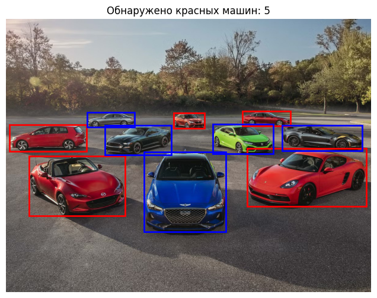

# Car Detection, Red Car Identification, and Image Captioning

## Project Overview

This project demonstrates the use of computer vision techniques to detect cars in an image, identify red cars, and generate descriptive captions for the image. It utilizes several advanced deep learning models:

1. YOLOv8: Used for car detection. YOLO (You Only Look Once) is a state-of-the-art real-time object detection model.
2. BLIP (Bootstrapping Language-Image Pretraining): Used to generate captions describing the image content.
3. OpenCV: For image processing, such as HSV-based color filtering to identify red cars.

This project is built in Python and leverages several powerful libraries to achieve the tasks in a smooth and efficient manner. 


Here is an example of the car detection and red car identification:




## Features

- Car Detection: Uses YOLOv8 pre-trained model to detect cars in images.
- Red Car Identification: Analyzes the detected cars and identifies red-colored cars based on color filtering in the HSV space.
- Image Captioning: Uses the BLIP model to generate a caption that includes the total number of cars detected and the count of red cars.

## Prerequisites

Before running the project, ensure that the following prerequisites are installed:

- Python 3.8 or higher: This project is built using Python 3.8. You can download Python from [here](https://www.python.org/downloads/).
- Poetry: A dependency management and packaging tool for Python. It helps in managing project dependencies efficiently. [Install Poetry](https://python-poetry.org/docs/#installation).

Additionally, you will need the following Python libraries, which will be installed automatically by Poetry:

- PyTorch: A deep learning library used for model inference.
- Transformers: A library for working with transformer-based models, such as BLIP.
- OpenCV: Used for image processing tasks like reading images and applying color filtering.
- Matplotlib: Used for visualizing the images and the detection results.
- Ultralytics (YOLO): The library containing the YOLOv8 pre-trained model for car detection.
- Pillow: A Python Imaging Library for handling image loading and transformations.

## Installation

To install the required dependencies, follow these steps:

1. Clone the repository or download the source code:
    
    git clone https://github.com/armangrigoryan96/car_detect_caption; cd car_detect_caption
    
2. Install Poetry if you don’t already have it:
    
   pip install poetry    

3. Install the project dependencies using Poetry:
    
    poetry install
    
This will automatically create a virtual environment and install all the necessary dependencies listed in pyproject.toml.

## Usage

After installation, you can run the script to detect cars, identify red cars, and generate captions for any image of your choice. The script can be executed from the command line with the --image_path argument, which specifies the path to the input image.

### Command to run the script:

```bash
python main.py --image_path path/to/your/image.jpg
